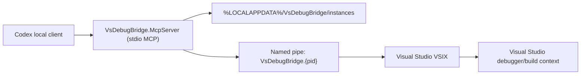

# Architecture

## Recommended Shape

The MVP should use a separate local MCP process, not MCP hosted inside the VSIX.

Reasons:

- Codex local clients can launch stdio MCP servers from `config.toml`.
- The VSIX stays focused on Visual Studio automation and avoids protocol/server lifecycle work.
- The MCP server can be reused by Codex CLI, ChatGPT desktop app, and IDE extension configuration.
- Named-pipe IPC keeps debugger context local to the machine and avoids opening an HTTP port for the MVP.

## Codex Surface Choice

Start with Codex CLI/config because it gives the fastest loop for local stdio MCP server startup, logs, and tool verification.

Shifting to ChatGPT desktop app or the IDE extension should be a configuration/runtime change, not an architecture change, because the server remains a standard local MCP process.

## Flow

## Snapshot Contents

- Active solution and active project.
- Current file, line, column, and source context around the current line.
- Debugger state: design, run, or break.
- Last break reason and current exception details when available.
- Current thread and selected stack frame.
- Current thread call stack.
- Current stack frame locals.
- Error List build errors.
- Output window panes with recent lines.

## Debug Actions

Do not add commands such as continue, step, breakpoint creation, or navigation to the read-only snapshot tool. Keep them as separate MCP tools so Codex approval policy can be configured per action.

The v0.5 debug-action tools also require `approved=true` in the request. Without that flag, the VSIX returns without executing the action.
